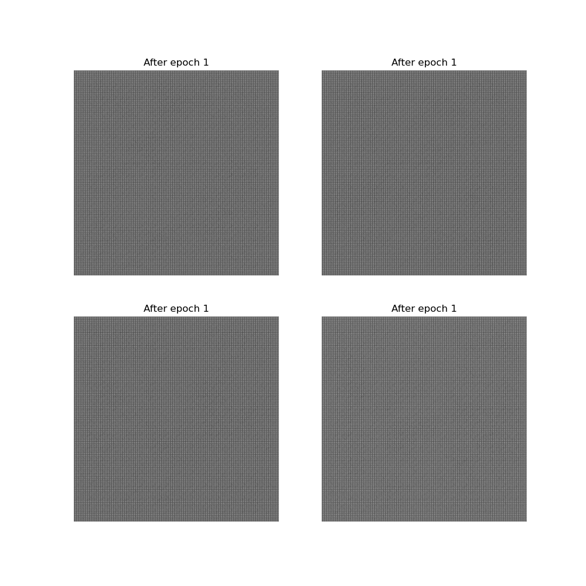
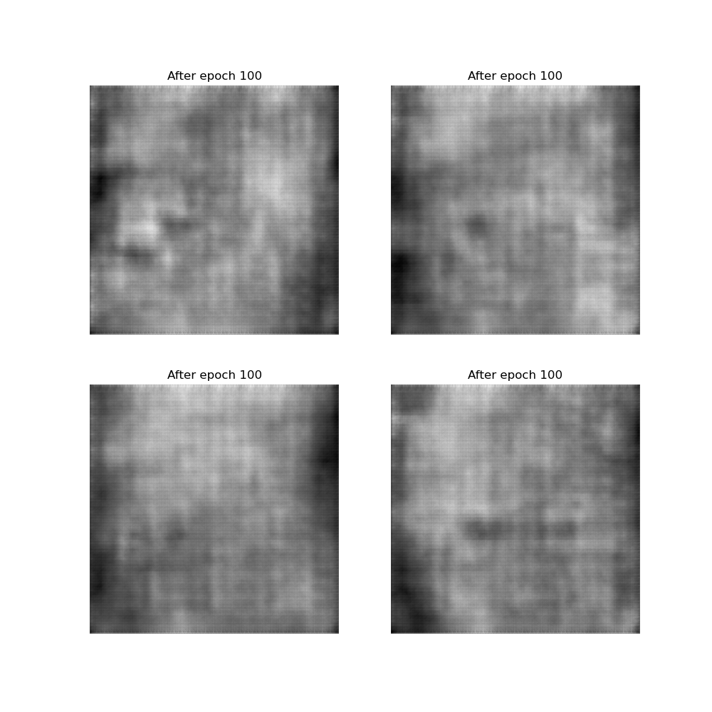
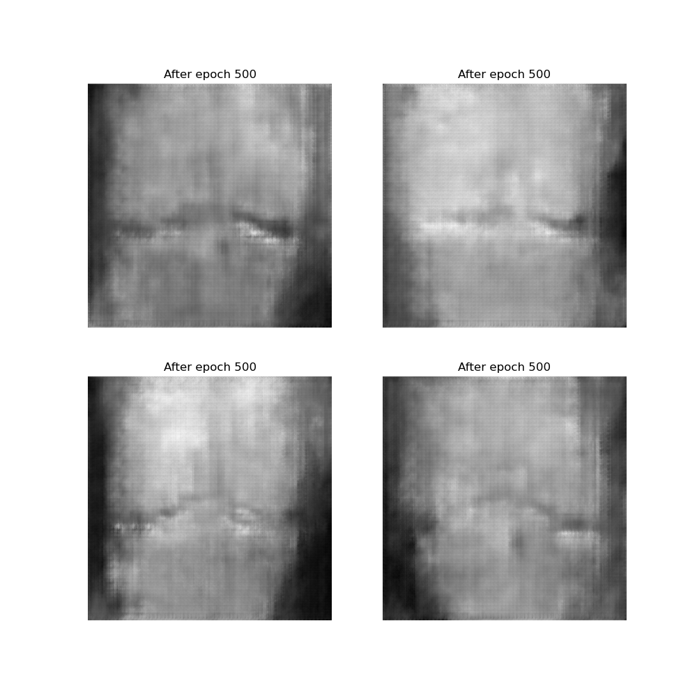
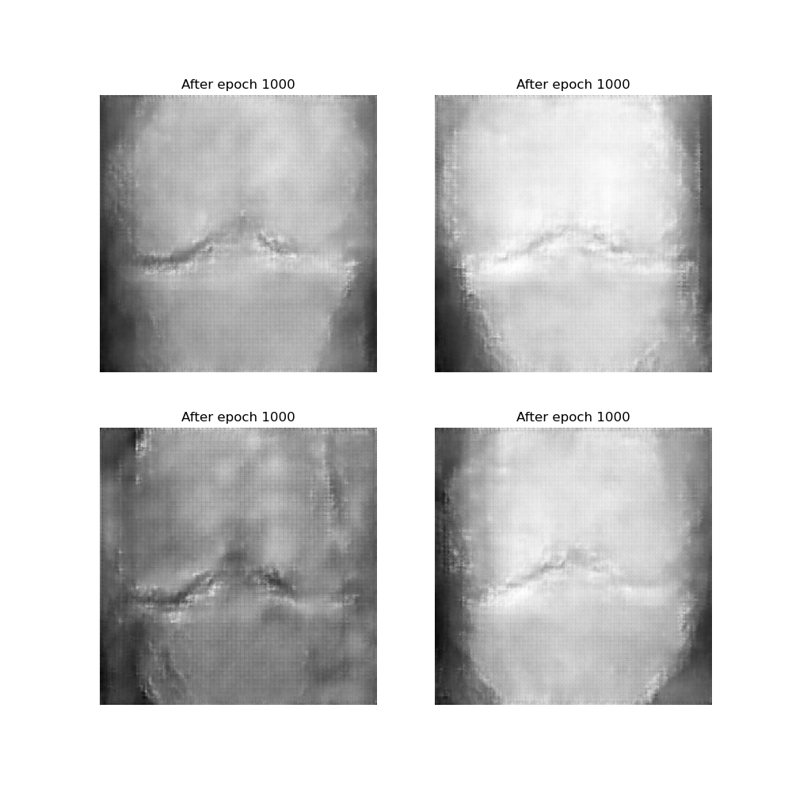
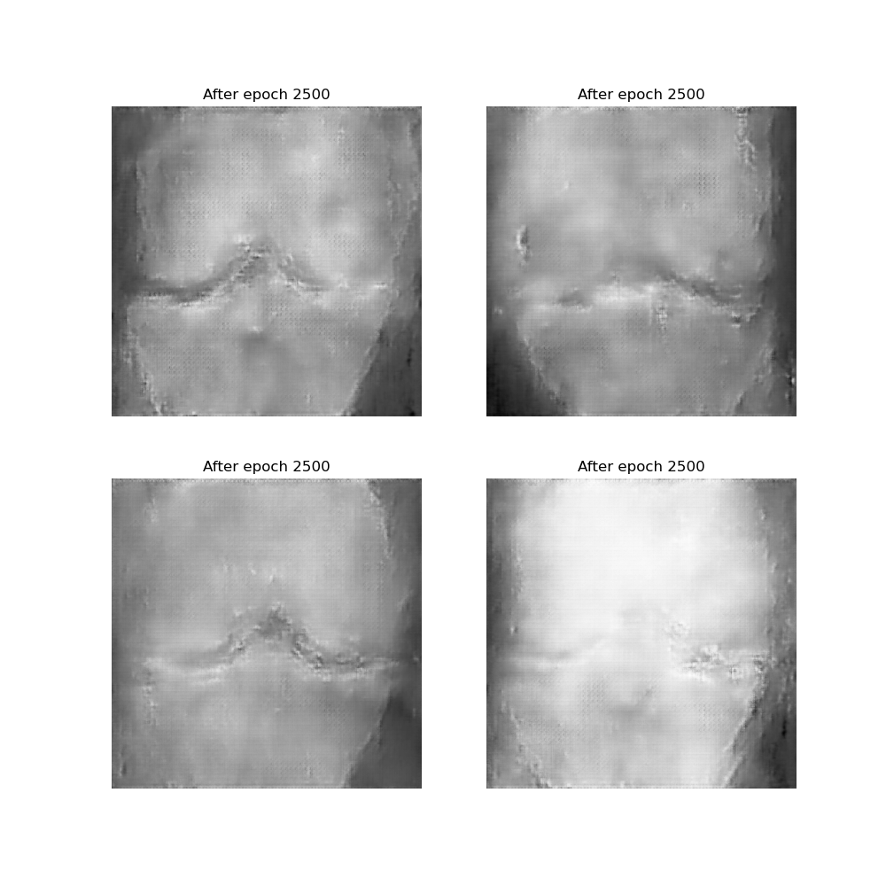

# Predicting Stages of Osteoarthritis

## What is Osteoarthritis
Osteoarthritis, often abbreviated as OA, It is a non-inflammatory type of Arthritis and a degenerative joint disease that primarily affects the cartilage in your joints. Cartilage is the slippery tissue that covers the ends of bones in a joint, allowing them to glide smoothly over each other during movement. In osteoarthritis, the cartilage breaks down and wears away, leading to pain, stiffness, and swelling in the affected joint(s). Over time, this can result in the bones rubbing against each other, causing further damage and discomfort.
Osteoarthritis is commonly associated with aging, as the wear and tear on joints accumulate over time. However, it can also be caused by factors such as joint injuries, obesity, genetics, and certain occupations or activities that put repetitive stress on particular joints. The lifetime risk of developing OA is 50%.

## Osteoarthritis of the Knee
Osteoarthritis of the knee occurs when the cartilage in the knee joint breaks down, allowing the bones to rub against each other. Because the knee joint, which is the most complex joint in the human body, bears the greatest load among all other joints, it is therefore most susceptible to the development of OA. This friction causes pain, stiffness, and sometimes swelling in the knees. It is the most common form of osteoarthritis and is characterized by high morbidity and disability rates.

### Stages of OA
1. <b>Stage 0 (Pre-Osteoarthritis)</b>: In this early stage, there may be no noticeable symptoms, but there could be subtle changes occurring within the joint, such as minor damage to the cartilage or changes in the surrounding tissues. Diagnosis may be based on risk factors, symptoms, and imaging tests like X-rays.
2. <b>Stage 1 (Mild)</b>: At this stage, there may be minor damage to the cartilage, but symptoms such as joint pain, stiffness, and swelling may be minimal or intermittent. The joint function might not be significantly affected yet, and symptoms might only occur after strenuous activity or at the end of the day.
3. <b>Stage 2 (Moderate)</b>: In this stage, there is more noticeable damage to the cartilage, with increased joint pain, stiffness, and swelling. Joint function may be noticeably impaired, and symptoms might occur more frequently, even with daily activities. X-rays may reveal visible changes such as narrowed joint space or bone spurs.
4. <b>Stage 3 (Severe)</b>: At this advanced stage, there is significant cartilage loss, leading to increased pain, stiffness, and swelling. Joint function is considerably impaired, and everyday activities may become difficult. X-rays may show significant joint damage, including pronounced bone spurs, cysts, and deformities.
5. <b>Stage 4 (End-Stage)</b>: This final stage involves severe cartilage loss, leading to bone-on-bone contact within the joint. Symptoms are typically severe and constant, with significant pain, stiffness, and swelling. Joint function is severely limited, and daily activities may be severely restricted. X-rays often show extensive joint damage and deformities.

## PART 1 - Generating Synthetic Knee X-Ray images using GANs

Generating synthetic knee X-ray images using Generative Adversarial Networks (GANs) is a cutting-edge approach in medical imaging research. GANs, a type of artificial intelligence algorithm, consist of two neural networks, a generator and a discriminator, engaged in a game-like process to produce realistic images. In this context, the generator learns to create knee X-ray images that closely resemble real ones, while the discriminator learns to distinguish between real and synthetic images. By training these networks on a dataset of authentic knee X-ray images, GANs can generate high-fidelity synthetic images that mimic various pathologies and anatomical variations. This technology holds immense potential for augmenting limited datasets, enhancing medical training, and aiding in diagnostic tasks, ultimately contributing to improved healthcare outcomes.

### Generator Architecture
The generator architecture starts with a dense layer that takes a latent noise vector as input and reshapes it into a 3D tensor. This tensor then undergoes a series of convolutional transpose layers, gradually increasing the spatial dimensions while reducing the depth. Leaky ReLU activation functions introduce non-linearity, and batch normalization aids in stabilizing training by normalizing the activations. The final layer uses a sigmoid activation function to ensure pixel values are in the range [0, 1], producing a synthetic knee X-ray image.

### Discriminator Architecture
The discriminator architecture begins with convolutional layers that downsample the input knee X-ray images while increasing the depth to extract features. Leaky ReLU activations are applied to introduce non-linearity, followed by max-pooling layers to reduce spatial dimensions. Batch normalization helps stabilize the learning process by normalizing the activations. The flattened output is then fed into dense layers with Leaky ReLU activations, followed by a final sigmoid layer to output the probability of the input image being real or synthetic.

#### Output (Generated images)

## PART 2 - Using Deep Learning   Predicting the Stages of Osteoarthritis
In leveraging Deep Learning for predicting the stages of Osteoarthritis, a ResNet architecture stands out as a robust choice. ResNet, short for Residual Neural Network, addresses the challenges of training very deep neural networks by utilizing residual connections, allowing for the successful training of networks with hundreds or even thousands of layers. By incorporating residual blocks that enable the flow of information along shortcut connections, ResNet facilitates the training of highly accurate models even with limited data. This architecture's ability to capture intricate patterns and features within medical imaging data makes it well-suited for discerning between the distinct stages of Osteoarthritis, aiding in early diagnosis and personalized treatment strategies.
We achieved an Accuracy of 98% when using ResNet.
